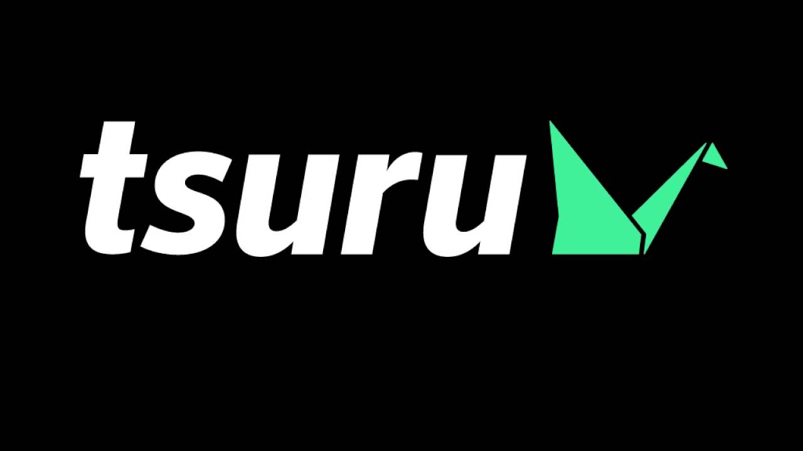

# tsuru

O Tsuru é uma plataforma como serviço (PaaS) open-source, projetada para melhorar a produtividade dos desenvolvedores, oferecendo uma forma eficiente e flexível de gerenciar e implantar aplicações em ambientes de produção. A ideia central do Tsuru é proporcionar uma experiência simples, mas poderosa, permitindo que os desenvolvedores se concentrem mais no código e menos na infraestrutura.

### Características principais do Tsuru:

1. **Facilidade de uso**: O Tsuru foi projetado para ser fácil de usar, com um foco especial na simplificação do processo de deploy e gestão de aplicações, proporcionando uma interface intuitiva tanto para desenvolvedores quanto para administradores.

2. **Multi-linguagem**: Ele suporta várias linguagens de programação (como Ruby, Python, Go, Java, entre outras), tornando-o uma plataforma flexível para diferentes tipos de projetos.

3. **Escalabilidade**: O Tsuru facilita a escalabilidade das aplicações. Ele permite que você aumente ou diminua a quantidade de recursos alocados para a aplicação de maneira simples, ajustando automaticamente conforme a demanda.

4. **Isolamento e segurança**: Ele oferece um bom nível de isolamento entre as aplicações, garantindo que uma aplicação não interfira nas demais. Além disso, o Tsuru utiliza containers, o que contribui para um ambiente mais seguro e controlado.

5. **Integração contínua e delivery**: O Tsuru integra-se bem com ferramentas de CI/CD (Integração Contínua e Entrega Contínua), ajudando a automatizar o ciclo de vida do desenvolvimento e fornecendo uma maneira ágil de fazer deploys frequentes.

6. **Suporte a microservices**: Ele oferece uma arquitetura que facilita a implementação e gerenciamento de microservices, permitindo que os desenvolvedores dividam suas aplicações em partes menores e mais fáceis de gerenciar.

7. **Open Source**: Por ser uma plataforma open-source, o Tsuru permite que as equipes de desenvolvimento personalizem e adaptem o sistema às suas necessidades específicas, além de poderem contribuir com melhorias para a comunidade.

### Como funciona o Tsuru?

O Tsuru utiliza containers (geralmente Docker) para empacotar e isolar as aplicações, o que proporciona flexibilidade e eficiência. Ele fornece uma camada de abstração sobre os containers, facilitando o gerenciamento das aplicações, sem exigir que os desenvolvedores se aprofundem em detalhes de infraestrutura.

Além disso, o Tsuru tem uma interface de linha de comando (CLI) que permite aos desenvolvedores realizar operações como deploy, escalabilidade, e monitoramento diretamente de seus terminais.

### Em resumo:

O Tsuru é uma ótima opção para equipes de desenvolvimento que buscam uma plataforma ágil, escalável e flexível para gerenciar suas aplicações, com a vantagem de ser open-source e altamente customizável. Ele facilita o desenvolvimento e o gerenciamento de aplicações complexas, permitindo aos desenvolvedores se concentrarem na construção do produto sem se preocupar com a infraestrutura.

Se você estiver trabalhando em um projeto que exige uma plataforma eficiente para automação de deploys e gestão de recursos, o Tsuru pode ser uma solução interessante a ser considerada.

site: https://tsuru.io/